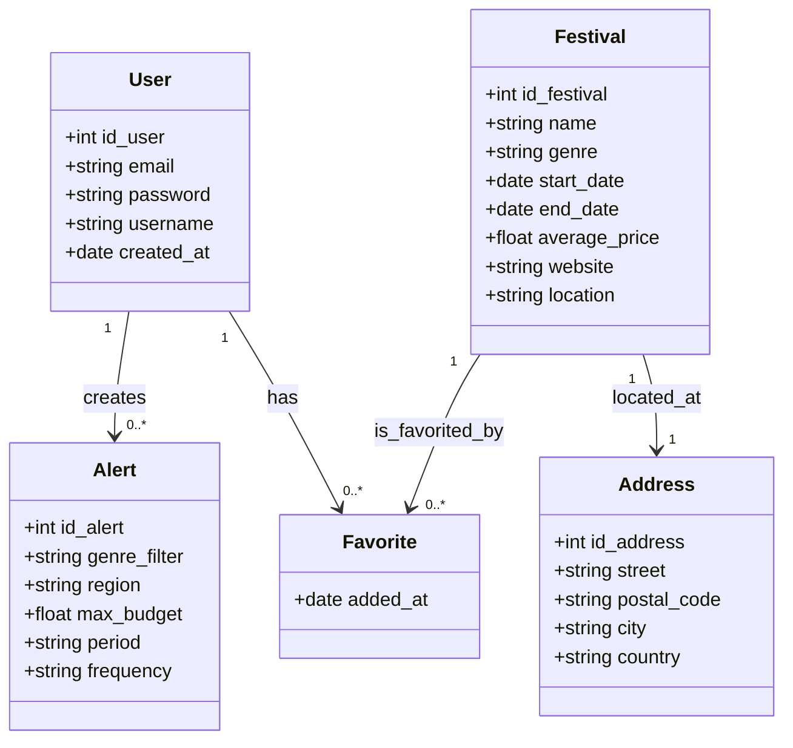

# 🎉 FestMap – Every festival. On one map.

FestMap est une application Micro-SaaS permettant de découvrir, filtrer et planifier les festivals musicaux autour de soi grâce à une carte interactive et personnalisée.

---

## 📌 Objectif du projet

Offrir un outil simple, visuel et efficace pour :
- Explorer les festivals par **genre musical, localisation, prix et période**
- **Favoriser** les festivals qui vous intéressent
- **Recevoir des alertes personnalisées**
- Planifier son **été musical** en quelques clics

---

## 👥 Public cible

- **Jeunes adultes**, étudiants, amateurs de musique live
- **Voyageurs ou groupes d’amis** cherchant à organiser leur tournée de festivals
- Toute personne souhaitant **gagner du temps** dans la recherche d’événements culturels

---

## 🧩 Fonctionnalités principales

- 🗺️ **Carte interactive** des festivals
- 🎶 **Filtres dynamiques** (genre, date, lieu, budget)
- ❤️ **Ajout aux favoris** (avec authentification)
- 🔔 **Alertes personnalisées**
- 🔐 Authentification sécurisée avec JWT

---

## 🎨 Charte graphique

- Style visuel : **Esthétique Festival** (inspiration plein air, coucher de soleil, pictos arrondis)
- Palette :
  - Coral pastel `#FFA07A`
  - Soft green `#7CB342`
  - Light beige `#F5F5DC`
  - Night blue `#112E57`
- Typographies : `Montserrat`, `Lato`, `Open Sans`

---

## 🛠️ Stack technique

### Frontend – Angular
- Framework SPA (Single Page Application)
- `Angular Material` pour les composants UI
- Carte interactive via `Leaflet` ou `Mapbox`
- JWT pour la gestion des sessions

### Backend – Java / Spring Boot
- API RESTful structurée avec `Spring Boot`
- Sécurité assurée avec `Spring Security + JWT`
- `Spring Data JPA` pour la gestion des entités

### Base de données – PostgreSQL
- Structure relationnelle MERISE
- Entités : User, Festival, Address, Favorite, Alert
- Possibilité d’extension via `PostGIS` pour la géolocalisation avancée

---

## 🧩 Modèle conceptuel de données (MCD)

---

## 🧭 Diagramme de cas d’usage UML

![[diagramme_cas_utilisation_festmap.png]]

---

## 🖼️ Wireframes (zoning)

![[Zooning_figma.png]]

---
